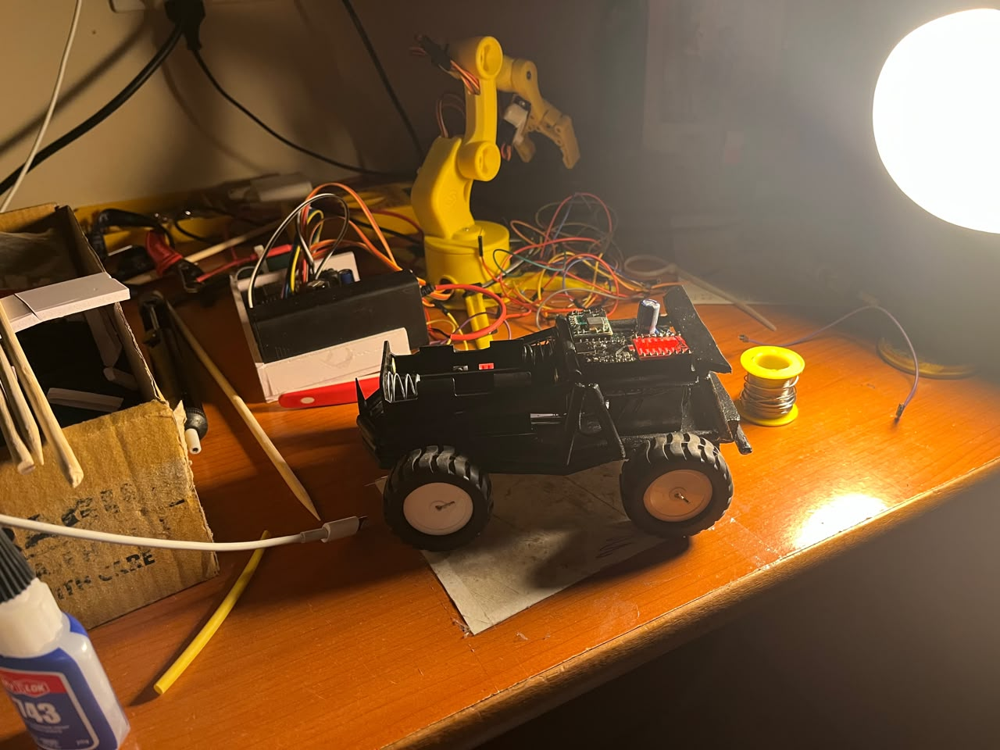
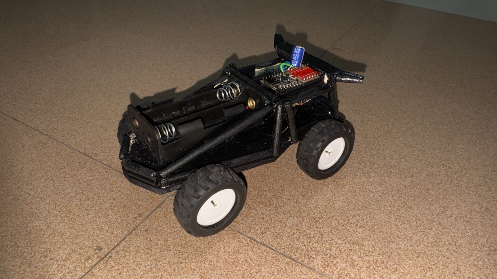
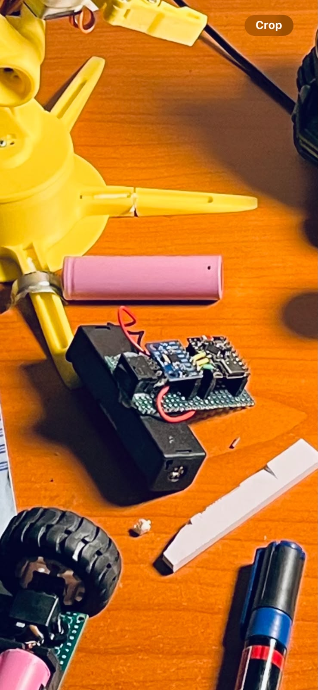

# Gesture-Controlled RC Car

An ESP32-based wireless RC car controlled through hand gestures using an MPU6050 accelerometer and ESP-NOW communication.

The project uses two ESP32 boards: one as the gesture-controlled transmitter and another as the receiver responsible for motor control. Tilting the transmitter changes the detected acceleration values, which are mapped to forward, backward, left, right, or stop commands.

---

## Project Images

### Transmitter

The transmitter uses an ESP32 and MPU6050 accelerometer to detect hand gestures and transmit movement commands wirelessly.


### Project Gallery

| Project View | Project View |
|--------------|--------------|
|  |  |
|  |  |

---

## Project Overview

This project demonstrates a wireless gesture-control system for a two-wheel robotic vehicle.

The transmitter reads motion data from an MPU6050 sensor and determines the intended direction based on acceleration along the X and Y axes. The selected command is transmitted wirelessly to the receiver using ESP-NOW.

The receiver interprets the command and drives two motors through a motor driver, allowing the vehicle to move in the requested direction.

The project provides practical experience with:

- ESP32 microcontrollers
- MPU6050 motion sensing
- ESP-NOW wireless communication
- DC motor control
- Embedded C/C++ programming
- Real-time sensor processing
- Wireless robotic control

---

## Features

- Gesture-based directional control
- Wireless ESP-NOW communication
- MPU6050 accelerometer input
- Forward and backward movement
- Left and right pivot control
- Stop command using a configurable dead zone
- Dual-motor control
- Adjustable motor speed
- Serial output for debugging and system status

---

## Hardware Components

| Component | Quantity |
|-----------|----------|
| ESP32 Development Boards | 2 |
| MPU6050 Accelerometer/Gyroscope | 1 |
| Motor Driver | 1 |
| DC Motors | 2 |
| Robotic Car Chassis | 1 |
| Battery / Power Supply | As required |
| Connecting Wires | As required |

The exact motor driver, chassis, battery configuration, and supporting hardware depend on the physical implementation of the vehicle.

---

## System Architecture

```text
                 TRANSMITTER

        MPU6050 Motion Sensor
                 |
                 v
              ESP32
                 |
                 | ESP-NOW
                 v
                 |
                 |
                 v
                 RECEIVER

              ESP32
                 |
                 v
           Motor Driver
             /       \
            v         v
        DC Motor   DC Motor
```

---

## Control Logic

The transmitter uses acceleration readings from the MPU6050 to determine the direction of movement.

| Sensor Condition | Command |
|------------------|---------|
| Y-axis > dead zone | Forward |
| Y-axis < -dead zone | Backward |
| X-axis > dead zone | Right |
| X-axis < -dead zone | Left |
| Within dead zone | Stop |

The current dead-zone value is:

```cpp
int deadZone = 3000;
```

This value can be adjusted depending on the sensitivity required for the controller.

---

## Direction Mapping

The transmitted control structure uses the following direction values:

```text
0 = STOP
1 = FORWARD
2 = BACKWARD
3 = LEFT
4 = RIGHT
```

The receiver uses these commands to select the corresponding motor-control function.

---

## Motor Control

The receiver controls two motors through a motor driver.

### Forward

Both motors are driven in the forward direction.

### Backward

Both motors are driven in the reverse direction.

### Left Pivot

The motors rotate in opposite directions to pivot the vehicle to the left.

### Right Pivot

The motors rotate in opposite directions to pivot the vehicle to the right.

### Stop

Both motor outputs are set to zero.

The configured maximum motor speed is:

```cpp
#define MAX_SPEED 130
```

This value can be adjusted according to the motor, power supply, and desired vehicle speed.

---

## Wireless Communication

The project uses ESP-NOW for communication between the transmitter and receiver ESP32 boards.

The transmitter:

1. Initializes Wi-Fi in station mode.
2. Configures the ESP-NOW communication channel.
3. Registers the receiver as an ESP-NOW peer.
4. Reads motion data from the MPU6050.
5. Determines the movement command.
6. Sends the command to the receiver.

The receiver:

1. Initializes Wi-Fi in station mode.
2. Initializes ESP-NOW.
3. Registers a receive callback.
4. Receives the movement command.
5. Selects the appropriate motor-control function.

The current implementation uses Wi-Fi channel 1 and an unencrypted ESP-NOW peer connection.

---

## Project Structure

```text
Gesture-control-rc-car/
│
├── code/
│   ├── receiver.ino
│   └── transmitter.ino
│
├── pic/
│   ├── pic1.jpeg
│   ├── pic2.jpeg
│   ├── pic3.jpeg
│   └── pic4.jpeg
├── wiring diagrams/
│   └── transmitter.png
└── README.md
```

---

## Getting Started

### Prerequisites

Install the following software and libraries:

- Arduino IDE
- ESP32 board support package
- Wire library
- MPU6050 library

You will also need:

- Two ESP32 boards
- One MPU6050 sensor
- A compatible motor driver
- Two DC motors
- A suitable power supply
- A robotic car chassis

---

## Setup

### 1. Clone the Repository

```bash
git clone https://github.com/yo5on/Gesture-control-rc-car.git
cd Gesture-control-rc-car
```

### 2. Configure the Transmitter

Open:

```text
code/transmitter.ino
```

The transmitter:

- Initializes the MPU6050.
- Reads acceleration values.
- Determines the desired direction.
- Sends the direction command through ESP-NOW.

Before uploading, make sure the receiver MAC address in the transmitter code matches the MAC address of the receiver ESP32.

### 3. Configure the Receiver

Open:

```text
code/receiver.ino
```

Verify the motor-driver pin configuration and connect the motor driver according to the pin definitions in the code.

### 4. Upload the Code

Upload `transmitter.ino` to one ESP32 and `receiver.ino` to the second ESP32.

Open the Serial Monitor at:

```text
115200 baud
```

The transmitter reports messages such as:

```text
MPU6050 OK
ESP-NOW READY
TX: FORWARD
TX: BACKWARD
TX: LEFT
TX: RIGHT
TX: STOP
```

The receiver reports the corresponding motor commands for debugging.

---

## MPU6050 Connections

The transmitter code uses I2C communication with the following configured pins:

| MPU6050 | ESP32 |
|---------|-------|
| SDA | GPIO 3 |
| SCL | GPIO 4 |

The remaining power and ground connections should be made according to the specific ESP32 and MPU6050 boards being used.

---

## Receiver Motor Pins

The receiver code defines the motor-control pins as:

| Function | GPIO |
|----------|------|
| PWMA | 2 |
| AIN1 | 3 |
| AIN2 | 4 |
| STBY | 5 |
| BIN1 | 8 |
| BIN2 | 9 |
| PWMB | 10 |

The motor-driver wiring should match these definitions or the corresponding values in `receiver.ino` should be updated.

---

## Working Principle

1. The MPU6050 detects acceleration caused by tilting the transmitter.
2. The transmitter ESP32 reads the X and Y acceleration values.
3. A configurable dead zone prevents small movements from generating unintended commands.
4. The ESP32 maps the detected motion to a directional command.
5. The command is transmitted to the receiver using ESP-NOW.
6. The receiver ESP32 validates the received data.
7. The receiver selects the appropriate motor-control routine.
8. The motor driver adjusts the direction and speed of the two motors.
9. The vehicle continuously responds to the transmitter's gestures.

---

## Safety and Power Considerations

- Use a suitable power supply for the ESP32, motor driver, and motors.
- Do not power high-current motors directly from an ESP32 GPIO.
- Ensure that the motor driver and ESP32 share an appropriate ground reference.
- Verify motor polarity before testing directional controls.
- Secure the battery and wiring before operating the vehicle.
- Test the vehicle at low speed before increasing the motor speed.

---

## Troubleshooting

### ESP-NOW communication fails

Check:

- Both ESP32 boards are powered correctly.
- The receiver MAC address is correct.
- Both devices are configured to use the same Wi-Fi channel.
- ESP-NOW initialization succeeds.
- The receiver has been added as a peer on the transmitter.

### MPU6050 is not detected

Check:

- SDA and SCL connections.
- Power and ground connections.
- The I2C pin configuration.
- That the MPU6050 library is installed correctly.

### Motors do not move

Check:

- Motor-driver wiring.
- Motor-driver power supply.
- STBY configuration.
- Motor connections.
- GPIO definitions in `receiver.ino`.

### Vehicle moves in the wrong direction

Check the motor polarity and the direction logic in the receiver code. Swap the motor connections or update the corresponding direction-control logic if necessary.

---

## Future Improvements

Potential improvements include:

- Adjustable gesture sensitivity
- Speed control based on tilt angle
- Smoother acceleration and deceleration
- Mobile application control
- Battery voltage monitoring
- OLED-based telemetry
- Obstacle detection
- Autonomous navigation
- Camera integration
- Improved wireless security
- Multiple gesture-based control modes

---

## Technologies

| Category | Technology |
|----------|------------|
| Microcontrollers | ESP32 |
| Programming | C/C++ |
| Motion Sensor | MPU6050 |
| Wireless Communication | ESP-NOW |
| Motor Control | Motor Driver |
| Motors | DC Motors |
| Development Environment | Arduino IDE |
| Communication Interface | I2C |

---

## Author

**Yoson**

Computer Science student interested in AI/ML, robotics, embedded systems, and automation.

GitHub: https://github.com/yo5on

---

## License

This project is intended for educational and personal use. You are free to explore, modify, and extend the project for your own robotics and embedded systems experiments.

---

If you find this project useful, consider giving the repository a star.
