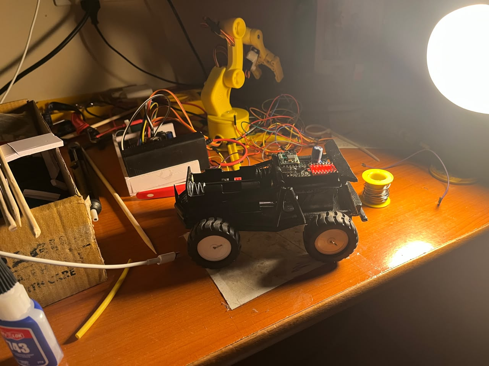
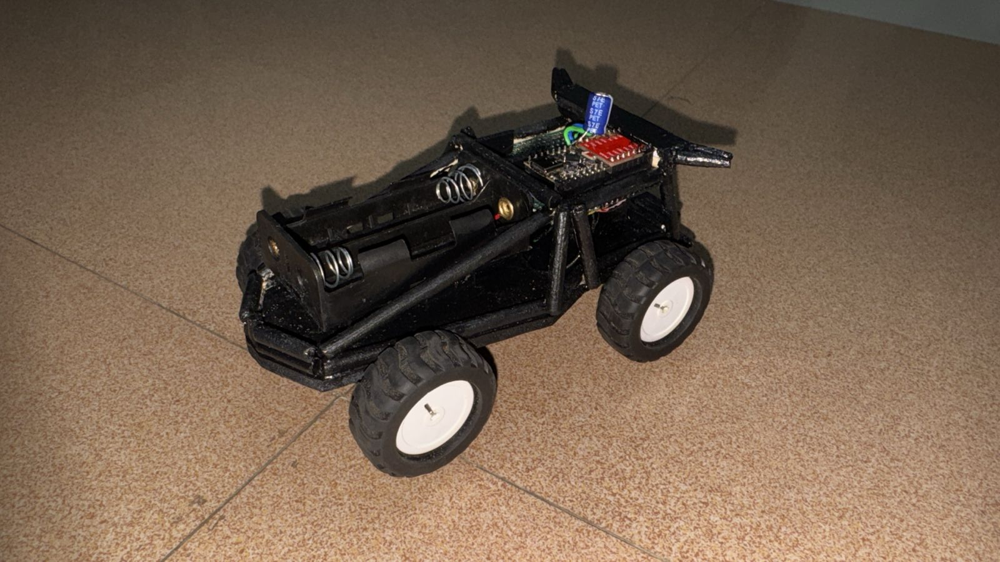
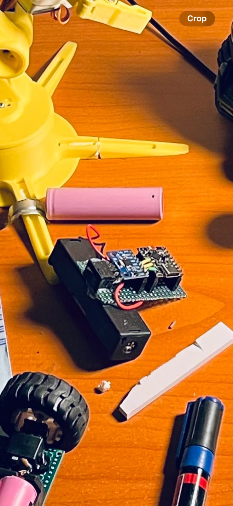

<div align="center">


<samp><b>gesture-controlled rc car</b></samp>

<samp>esp32 · mpu6050 · esp-now · embedded systems</samp>

</div>

---

<samp>An ESP32-based wireless RC car controlled through hand gestures using an MPU6050 accelerometer and ESP-NOW communication.</samp>

<samp><b>overview</b></samp>

<samp>The project uses two ESP32 boards: one as the gesture-controlled transmitter and another as the receiver responsible for motor control. Tilting the transmitter changes the detected acceleration values, which are mapped to forward, backward, left, right, or stop commands.</samp>

<samp><b>project images</b></samp>

| <samp></samp> | <samp></samp> |
|---|---|
|  |  |
|  |  |

<samp><b>features</b></samp>

<samp>· gesture-based directional control<br>
· wireless communication using ESP-NOW<br>
· MPU6050 accelerometer input<br>
· forward and backward movement<br>
· left and right pivot control<br>
· configurable movement dead zone<br>
· dual-motor control<br>
· adjustable motor speed<br>
· serial output for debugging<br>
· two-ESP32 transmitter and receiver architecture</samp>

<samp><b>hardware components</b></samp>

<table>
<tr><th><samp>component</samp></th><th><samp>quantity</samp></th></tr>
<tr><td><samp>ESP32 Development Boards</samp></td><td><samp>2</samp></td></tr>
<tr><td><samp>MPU6050 Accelerometer/Gyroscope</samp></td><td><samp>1</samp></td></tr>
<tr><td><samp>Motor Driver</samp></td><td><samp>1</samp></td></tr>
<tr><td><samp>DC Motors</samp></td><td><samp>2</samp></td></tr>
<tr><td><samp>Robotic Car Chassis</samp></td><td><samp>1</samp></td></tr>
<tr><td><samp>Battery / Power Supply</samp></td><td><samp>as required</samp></td></tr>
<tr><td><samp>Connecting Wires</samp></td><td><samp>as required</samp></td></tr>
</table>

<samp><b>transmitter</b></samp>

<samp>The transmitter consists of an ESP32 and an MPU6050 motion sensor. The MPU6050 detects movement and tilt, the ESP32 converts acceleration values into movement commands, and ESP-NOW sends those commands wirelessly to the receiver.</samp>

<samp><b>wiring</b></samp>

<table>
<tr><th><samp>MPU6050</samp></th><th><samp>ESP32</samp></th></tr>
<tr><td><samp>VCC</samp></td><td><samp>3.3V</samp></td></tr>
<tr><td><samp>GND</samp></td><td><samp>GND</samp></td></tr>
<tr><td><samp>SDA</samp></td><td><samp>GPIO 3</samp></td></tr>
<tr><td><samp>SCL</samp></td><td><samp>GPIO 4</samp></td></tr>
</table>


<samp><b>direction logic</b></samp>

<table>
<tr><th><samp>sensor condition</samp></th><th><samp>command</samp></th></tr>
<tr><td><samp>Y-axis &gt; dead zone</samp></td><td><samp>forward</samp></td></tr>
<tr><td><samp>Y-axis &lt; -dead zone</samp></td><td><samp>backward</samp></td></tr>
<tr><td><samp>X-axis &gt; dead zone</samp></td><td><samp>right</samp></td></tr>
<tr><td><samp>X-axis &lt; -dead zone</samp></td><td><samp>left</samp></td></tr>
<tr><td><samp>within dead zone</samp></td><td><samp>stop</samp></td></tr>
</table>

```cpp
int deadZone = 3000;
```

<samp><b>direction mapping</b></samp>

```text
0 = STOP
1 = FORWARD
2 = BACKWARD
3 = LEFT
4 = RIGHT
```

<samp><b>receiver</b></samp>

<samp>The receiver consists of an ESP32 and a motor driver connected to two DC motors. It receives commands through ESP-NOW and controls the motor driver accordingly.</samp>

<samp><b>wiring</b></samp>


<table>
<tr><th><samp>function</samp></th><th><samp>GPIO</samp></th></tr>
<tr><td><samp>PWMA</samp></td><td><samp>2</samp></td></tr>
<tr><td><samp>AIN1</samp></td><td><samp>3</samp></td></tr>
<tr><td><samp>AIN2</samp></td><td><samp>4</samp></td></tr>
<tr><td><samp>STBY</samp></td><td><samp>5</samp></td></tr>
<tr><td><samp>BIN1</samp></td><td><samp>8</samp></td></tr>
<tr><td><samp>BIN2</samp></td><td><samp>9</samp></td></tr>
<tr><td><samp>PWMB</samp></td><td><samp>10</samp></td></tr>
</table>

<samp><b>motor control</b></samp>

<samp>The vehicle supports forward, backward, left, right, and stop states. The configured maximum motor speed is:</samp>

```cpp
#define MAX_SPEED 130
```

<samp><b>wireless communication</b></samp>

<samp>The transmitter and receiver communicate using ESP-NOW.</samp>

```text
Transmitter
    |
    | ESP-NOW
    v
Receiver
    |
    v
Motor Driver
   / \
  v   v
Motor Motor
```

<samp>The current implementation uses Wi-Fi channel 1 and an unencrypted ESP-NOW peer connection.</samp>

<samp><b>working principle</b></samp>

<samp>1. the user tilts the transmitter.<br>
2. the MPU6050 detects the resulting acceleration.<br>
3. the transmitter ESP32 reads the X and Y acceleration values.<br>
4. the values are compared with the configured dead zone.<br>
5. a movement command is selected.<br>
6. the command is transmitted using ESP-NOW.<br>
7. the receiver ESP32 processes the command.<br>
8. the motor driver controls the two DC motors.</samp>

<samp><b>project structure</b></samp>

```text
Gesture-control-rc-car/
├── code/
│   ├── receiver.ino
│   └── transmitter.ino
├── pic/
│   ├── pic1.jpeg
│   ├── pic2.jpeg
│   ├── pic3.jpeg
│   └── pic4.jpeg
├── wiring diagrams/
│   ├── transmitter.png
│   └── receiver.png
└── README.md
```

<samp><b>getting started</b></samp>

<samp><b>prerequisites</b></samp>

<samp>· Arduino IDE<br>
· ESP32 board support package<br>
· Wire library<br>
· MPU6050 library<br>
· two ESP32 development boards<br>
· MPU6050 sensor<br>
· compatible motor driver<br>
· two DC motors<br>
· robotic car chassis<br>
· suitable power supply</samp>

<samp><b>clone</b></samp>

```bash
git clone https://github.com/yo5on/Gesture-control-rc-car.git
cd Gesture-control-rc-car
```

<samp><b>transmitter</b></samp>

<samp>Open <code>code/transmitter.ino</code>, verify the receiver ESP32 MAC address, and upload it to the ESP32 connected to the MPU6050.</samp>

<samp><b>receiver</b></samp>

<samp>Open <code>code/receiver.ino</code>, verify the motor-driver GPIO configuration, and upload it to the second ESP32.</samp>

<samp><b>serial monitor</b></samp>

<samp>Use the Arduino IDE Serial Monitor at <code>115200</code> baud for transmitter and receiver diagnostics.</samp>

<samp><b>safety and power considerations</b></samp>

<samp>· use an appropriate power supply for the ESP32, motor driver, and motors.<br>
· do not power high-current motors directly from ESP32 GPIO pins.<br>
· ensure the motor driver and ESP32 have an appropriate common ground.<br>
· verify motor polarity before testing directional controls.<br>
· secure the battery and wiring before operating the vehicle.<br>
· test at low speed before increasing motor speed.</samp>

<samp><b>troubleshooting</b></samp>

<samp><b>ESP-NOW communication fails</b></samp>

<samp>Check power, receiver MAC address, Wi-Fi channel, ESP-NOW initialization, and peer registration.</samp>

<samp><b>MPU6050 is not detected</b></samp>

<samp>Check SDA/SCL, power, ground, I2C configuration, and library installation.</samp>

<samp><b>motors do not move</b></samp>

<samp>Check motor-driver wiring, motor-driver power, STBY configuration, motor connections, and GPIO definitions.</samp>

<samp><b>future improvements</b></samp>

<samp>· adjustable gesture sensitivity<br>
· speed control based on tilt angle<br>
· smoother acceleration and deceleration<br>
· mobile application control<br>
· battery voltage monitoring<br>
· OLED telemetry display<br>
· obstacle detection<br>
· autonomous navigation<br>
· camera integration<br>
· improved wireless security<br>
· additional gesture-based control modes</samp>

<samp><b>technologies</b></samp>

<table>
<tr><th><samp>category</samp></th><th><samp>technology</samp></th></tr>
<tr><td><samp>Microcontrollers</samp></td><td><samp>ESP32</samp></td></tr>
<tr><td><samp>Programming</samp></td><td><samp>C/C++</samp></td></tr>
<tr><td><samp>Motion Sensor</samp></td><td><samp>MPU6050</samp></td></tr>
<tr><td><samp>Wireless Communication</samp></td><td><samp>ESP-NOW</samp></td></tr>
<tr><td><samp>Motor Control</samp></td><td><samp>Motor Driver</samp></td></tr>
<tr><td><samp>Motors</samp></td><td><samp>DC Motors</samp></td></tr>
<tr><td><samp>Development Environment</samp></td><td><samp>Arduino IDE</samp></td></tr>
<tr><td><samp>Communication Interface</samp></td><td><samp>I2C</samp></td></tr>
</table>

<samp><b>author</b></samp>

<samp><b>Yoson</b></samp>

<samp>Computer Science student interested in AI/ML, robotics, embedded systems, and automation.</samp>

<samp>GitHub: https://github.com/yo5on</samp>

<samp><b>license</b></samp>

<samp>This project is intended for educational and personal use. You are free to explore, modify, and extend the project for robotics and embedded systems experiments.</samp>
